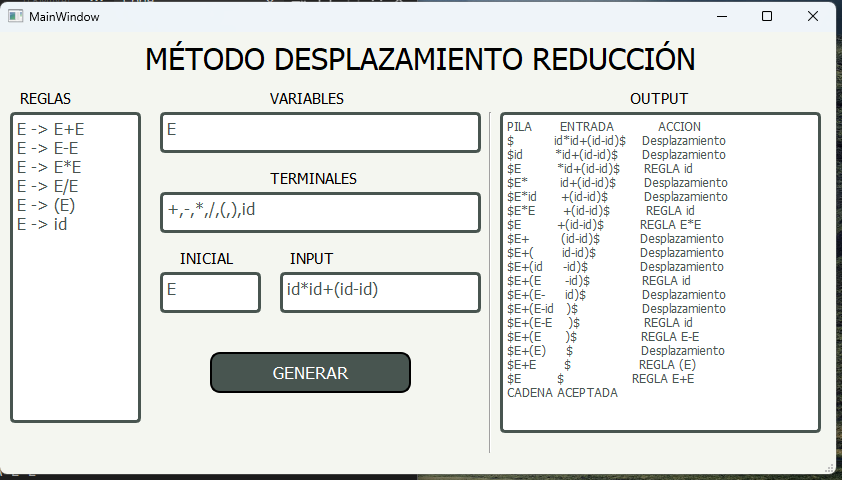
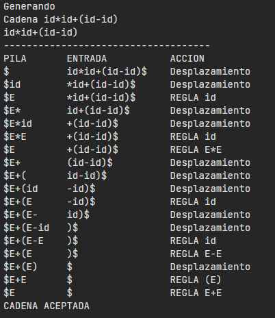

# **Método desplazamiento reducción**

Programación de sistema de base. Aplicación del método desplazamiento reducción mediante una entrada: 

**REGLAS PARA REDUCCIÓN**
```
E -> E+E
E -> E-E
E -> E*E
E -> E/E
E -> (E)
E -> id
```

**VARIABLES**
```
E
```

**TERMINALES**
```
+,-,*,/,(,),id
```

**INICIAL** 
```
E
```

**CADENA W**
```
id*id+(id-id)
```

<br>

El resultado se muestra en la interfaz gráfica y en la consola.



